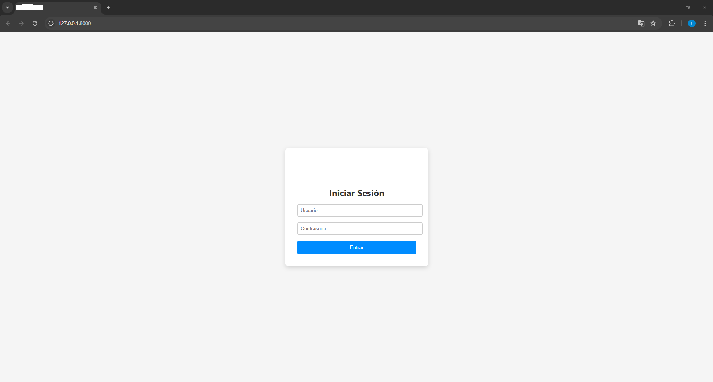
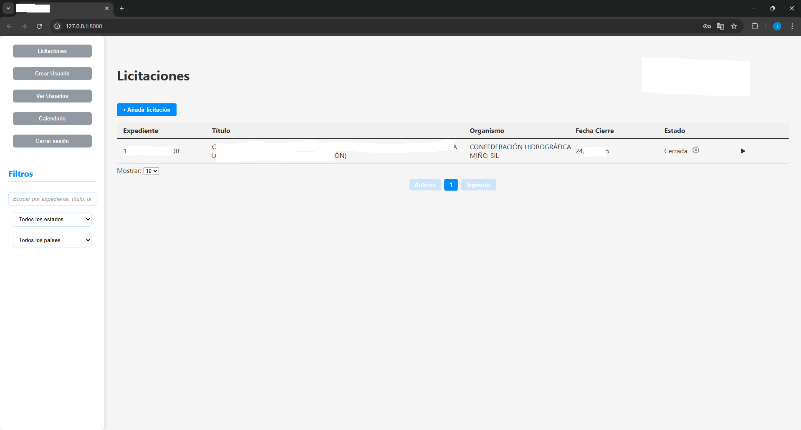
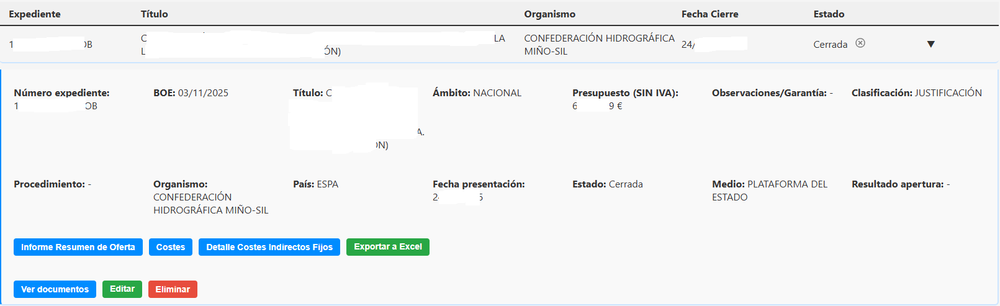
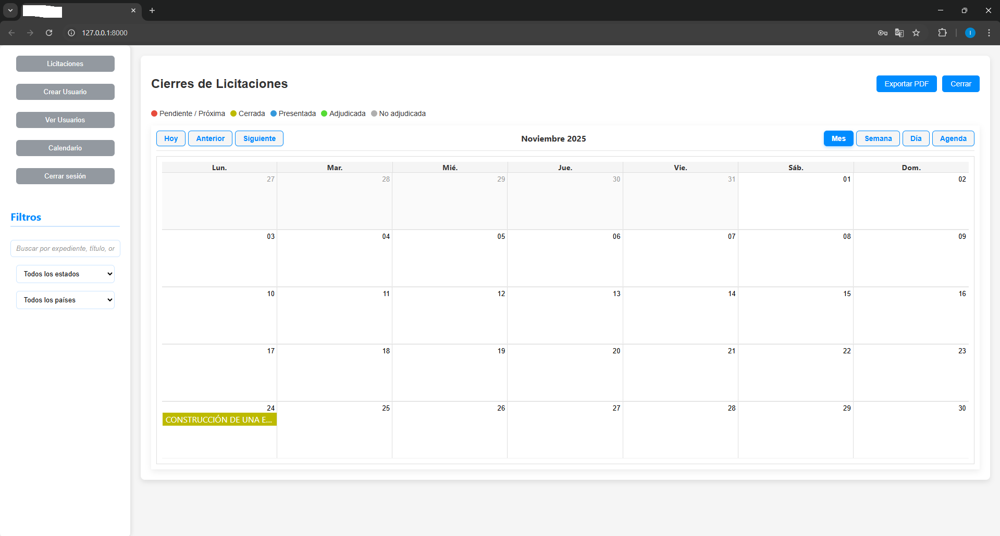

# Dashboard de Gestión de Licitaciones

## Descripción
Aplicación web interna desarrollada con FastAPI y React para centralizar la gestión de licitaciones de la empresa. Permite crear, modificar y consultar licitaciones, visualizar fechas clave en un calendario, recibir alertas automáticas de plazos próximos y gestionar accesos mediante roles de usuario. La base de datos está centralizada para uso multiusuario y se alimenta principalmente mediante la carga de ficheros CSV generados a partir de procesos de scraping sobre las plataformas oficiales de contratación. La aplicación se despliega en un servidor VPS y es accesible bajo un subdominio.

## Tecnologías utilizadas
- Backend: FastAPI  
- Frontend: React  
- Base de datos: SQLite 
- Control de accesos: Gestión de roles de usuario  

## Capturas de pantalla

### Inicio de sesión
  
Panel principal para iniciar sesión con cuenta de usuario.

### Vista general del dashboard
  
Panel principal con lista de licitaciones, principales datos y estado. Además incluye diferentes filtros para poder listar. Se ha añadido el botón para cargar csv y alimentar el dashboard con los datos obtenidos del scrapeo y el botón para exportar los datos de todas las licitaciones guardadas.

### Vista expandida de licitación
  
Vista expandida de una licitación donde se pueden observar todos los datos de la misma. Incluye un gestor de documentos para poder adjuntar los documentos oportunos de cada licitación. Además permite cumplimentar todos los datos de las ofertas (Informe resumen, Costes y Detalle costes Indirectos) y posteriormente exportarlo en una plantilla propia de la empresa en Excel. Al final se incluye en enlace oficial del anuncio.

### Calendario de licitaciones
  
Visualización de todas las licitaciones con fechas clave y alertas automáticas.

## Beneficios
- Mejora la organización y el seguimiento de licitaciones.
- Elimina procesos manuales basados en Excel.
- Automatiza la carga y actualización de datos a partir de CSV generados vía scraping de plataformas oficiales.
- Notificaciones automáticas de plazos.
- Control multiusuario con roles de acceso.

